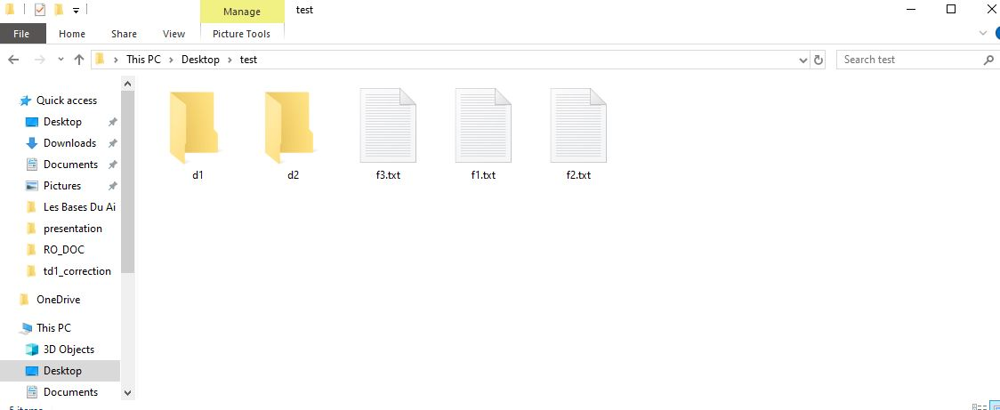

# Getting into Practice: Input / Output
## Exercise 1 – Simulating the `ls` Command in Java

---

## Topic
This exercise focuses on **Java Input/Output (I/O)** and **file system manipulation**.  
The goal is to simulate the behavior of the Unix/Linux `ls` command by listing files and directories along with their permissions.

---

## Key Concepts

- **Java I/O (Input / Output)**
- **Reading user input** using `Scanner`
- **File system handling** with `java.io.File`
- **Access permissions**
    - Read permission (`r`)
    - Write permission (`w`)
    - Hidden files (`h`)


---

## Code Explanation

###  1. Importing Required Classes
```java
import java.io.File;
import java.util.Scanner;
```
- `File` is used to represent files and directories.
- `Scanner` is used to read input from the user.

---

### 2. Reading the Directory Path
```java
Scanner sc = new Scanner(System.in);
System.out.println("Please enter the full path : ");
String path = sc.nextLine();
```
- The user enters the full path of the directory.
- The path is stored as a String.

---

### 3. Creating a File Object
```java
File directory = new File(path);
```
- The File object represents the directory entered by the user.

---

### 4. Validating the Directory
```java
if (!directory.exists() || !directory.isDirectory()) {
    System.out.println("Path does not exist or is not a directory");
}
```
- Checks whether the path exists.
- Ensures that the path points to a directory and not a file.

---
### 5. Listing Directory Content

```java
File[] files = directory.listFiles();
```
- Retrieves all files and subdirectories inside the directory.

- Returns null if the directory is empty or inaccessible.

---

### 6. Handling Empty Directory

```java
if (files == null) {
    System.out.println("Empty Directory ");
}
```
- Prevents NullPointerException.
- Displays a message if the directory has no content.
---

### 7. Processing Each File and Directory
```java
for (File file : files) {
    
        }
```
- Iterates through each file and subdirectory.

---

### 8. Determining Type (File or Directory)

```java
String type = file.isDirectory() ? "<DIR>" : "<FILE>";
```
- Uses a ternary operator to determine the type.

### 9. Checking Permissions
```java
String read = file.canRead() ? "r" : "-";
String write = file.canWrite() ? "w" : "-";
String hidden = file.isHidden() ? "h" : "-";
```
- Checks read, write, and hidden permissions.
- Displays - if the permission is not granted.

---
 
### 10. Displaying the Result
```java
System.out.println(
    file.getAbsolutePath() + " " + type + " " + read + write + hidden
);
```
- Prints the absolute path, type, and permissions of each element

### output :


```shell
Please enter the full path : 
C:\Users\info\Desktop\test
```
```terminaloutput
C:\Users\info\Desktop\test\d1 <DIR> rw-
C:\Users\info\Desktop\test\d2 <DIR> rw-
C:\Users\info\Desktop\test\f1.txt <FILE> rw-
C:\Users\info\Desktop\test\f2.txt <FILE> rw-
C:\Users\info\Desktop\test\f3.txt <FILE> rw-
```


